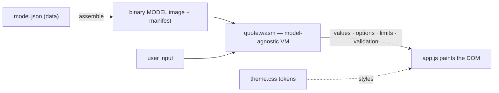

# wasm-calculator — a model-driven quote configurator

A **quote/configurator machine** whose entire form — the fields, the rules for
when things appear, and the pricing — is described as **data** in `model.json`
and evaluated by a **model-agnostic WebAssembly engine**. Change the model and
republish; the engine never needs rebuilding. Restyle it by editing design
tokens; the logic never needs touching.

The example model is a **vehicle configurator** (trims gate engines, packages
have prerequisites and conflicts, financing reveals a computed monthly payment).
Swap `model.json` for your own domain — see [Deploy a new model](#deploy-a-new-model).



## Three layers, one wall between each

| Layer | Owner | Files | Contains | Never contains |
|---|---|---|---|---|
| **Model** | Non-dev author | `model.json` (+ `model.schema.json`) | fields, sections, control hints, and all logic (conditions, pricing, effects, validations) | any colour, font, size, class, CSS |
| **Engine** | Dev (built once) | `assembly/quote.ts` → `quote.wasm`, `web/assembler.mjs`, `web/app.js`, `web/qc-base.css` | the VM, the assembler, the DOM contract, structural CSS | brand look, per-model logic |
| **Designer** | Designer | `web/theme.css` | `--qc-*` tokens (light/dark) + skins | logic, markup, field ids |

The same `quote.wasm` runs the public site and (later) the editor's live preview,
so preview and production can never diverge.

## How it works

- **`web/assembler.mjs`** flattens `model.json` into a compact binary image (a
  preorder AST + structural records + baked lookup tables) plus a JS-side
  manifest. It also carries `referenceEvaluate()` — a JS mirror of the VM used as
  a test oracle.
- **`assembly/quote.ts` (QCM1 VM)** walks that image: an `evalNode()` switch over
  the AST inside a fixed `evaluate()` loop (reset → bounded *settle* for effects,
  option availability, and auto-deselect → compute → outputs → validations).
  The JS⇄wasm boundary is numbers/bytes only — strings stay in JS.
- **`web/app.js`** renders the form once from the manifest, then on every change
  reads the controls, calls `evaluate()`, and paints: values, which options are
  available, field visibility/limits, engine-forced values, and validation — all
  onto the stable `qc-*` DOM contract.

## Project structure

```
assembly/quote.ts        # the QCM1 VM (compiled once to quote.wasm)
web/
  model.json             # THE MODEL — the whole configurator, as data
  model.schema.json      # JSON Schema (editor autocomplete + validation)
  assembler.mjs          # model -> binary image + manifest; loadEngine; reference oracle
  app.js                 # generic front-end (render + drive VM + paint)
  qc-base.css            # engine-owned structure (tokens only)
  theme.css              # designer-owned tokens (light/dark) + skins
  index.html             # shell
scripts/
  validate-model.mjs     # build gate: fails the build on a bad model
  build-site.mjs         # assemble the flat dist/
test/
  ref-eval.test.mjs      # golden scenarios vs the reference evaluator
  vm-parity.test.mjs     # wasm VM == reference (golden + 500 random configs)
docs/phase1-spec.md      # the full engine/design spec
server.mjs               # zero-dep dev server (flat URLs, correct .wasm MIME)
asconfig.json · wrangler.jsonc · .nvmrc
```

## Getting started

```bash
npm install
npm start            # builds quote.wasm, serves http://localhost:8080/
```

Other scripts:

```bash
npm run build          # validate model -> compile wasm -> assemble dist/
npm test               # reference + wasm-parity suites
npm run validate:model # just the build-gate model check
```

## Deploy a new model

Publishing a model **does not rebuild the engine** — `quote.wasm` is
model-agnostic. Editing the model is editing data.

1. **Edit `web/model.json`** (keep the leading `"$schema": "./model.schema.json"`
   for autocomplete + inline validation of field types, control enums, width
   tokens, expression ops, and table shapes).
2. **`npm run build`** runs `validate-model` first. On any problem — unknown
   field/option/table reference, a dependency cycle, a bad enum, too-deep
   expression — it prints the error and **fails the build**, so a broken model
   never deploys.
3. **Push to `main`.** Cloudflare Pages runs `npm run build` (Node pinned by
   `.nvmrc`) and publishes `dist/`. Live at
   **https://quote.rowblaa.com** within a minute or two.
   > Phase 2 will move `model.json` behind a single URL backed by Cloudflare KV,
   > so publishing becomes a write with no rebuild at all; `app.js` fetches from
   > one constant URL either way.

### What the model can express

`fields` (`choice` / `multichoice` / `number` / `boolean` / `computed`) with a
`control` hint (`radio` / `dropdown` / `buttons` / `stepper`), `section`, and
coarse `width`; per-option and per-field conditions (`visibleWhen`,
`enabledWhen`, `availableWhen`); dynamic `min`/`max`/`step`; `effects`
(`when → set a field`, e.g. Off-road → AWD); `computed` values and `tables`
(1D/2D lookups); `validations`; and `outputs`. Expressions are a small AST —
`{ "op": "...", "args": [...] }` — with `field`, `const`, comparisons, `and`/`or`/
`not`, `has`/`notHas`, arithmetic, `min`/`max`/`pow`, `if`, and `lookup`.

## Restyle it (designers)

Everything visual lives in **`web/theme.css`** as `--qc-*` tokens (colours,
type, spacing, radius) with a full light and dark palette. To rebrand, change
the token values. To offer alternates, add a block under
`:root[data-skin="yourskin"]` and switch with `data-skin` on `<html>`. You never
touch `model.json`, `app.js`, or the wasm. The generated markup is a stable set
of `qc-*` classes + `data-*` hooks (`data-field`, `data-output`, state classes
like `is-hidden`/`is-disabled`/`is-invalid`/`is-forced`) — style against those,
never tag/`nth-child`.

## License

[MIT](LICENSE) © rossjdharrison
