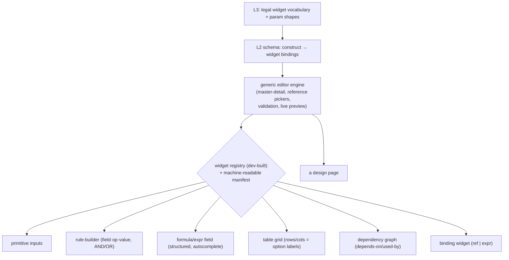
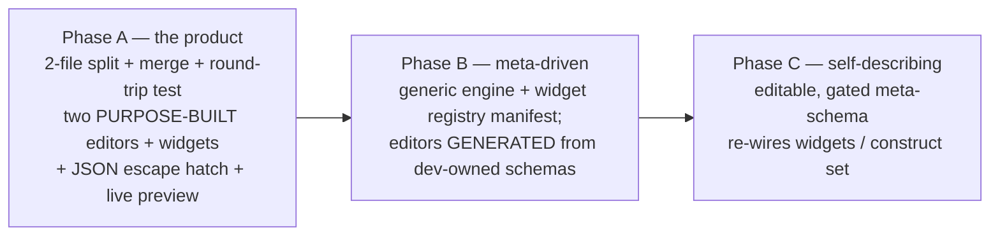

# Model Editor — Architecture Spec

**A self-describing, metadata-driven modeling platform for the quote engine.**

Status: design (pre-build). Scope: the full reflective platform, built in phases
**A → B → C**. Extends [phase1-spec.md](phase1-spec.md) (the runtime engine, QCM1).

> This revision incorporates an architecture review. The load-bearing correction:
> **the data/presentation split is an *authoring-time* separation, not a runtime
> data-flow partition.** At build/load time a `merge(data, presentation)`
> reconstructs the single combined model that the Phase-1 assembler and engine
> consume **unchanged**. Everything below is written to that fact.

---

## 1. What we are building, and why

Phase 1 gave us a **model-agnostic WebAssembly engine** that runs any combined
model image. This platform is the authoring side: it lets non-developers create
and maintain models — and, ultimately, reshape the authoring tools themselves —
without code.

Three settled decisions:

1. **Author the model as two files** — a *data model* (semantics: what is
   calculated and how things interrelate) and a *presentation model* (how data is
   shown/edited, via bindings). They are **merged back into one combined model**
   for execution.
2. **Two design pages** — a **Data** page (seen first: calculations and
   interdependencies) and a **Presentation** page (objects, layout, conditional
   display, each bound to a data item or a small expression).
3. **A reachable meta-schema** — from either design page you can reach the
   meta-schema; editing it changes what the schemas can express and therefore, one
   step down, **reshapes the design pages**. This makes the platform
   self-describing. (Precise layering in §2/§5.)

This is a known pattern (Meta-Object Facility / Eclipse EMF-Ecore / language
workbenches) — powerful, with well-known failure modes this document is written to
avoid.

---

## 2. The layer tower (and the two regresses it terminates)

One type/instance tower. **At each level, the artifact one level up is the
metadata that drives the editor for the level below.**

| Level | Artifact | Example | Authored by | Its editor is driven by |
|---|---|---|---|---|
| **L0 — Instance** | one filled-in quote | city + sport + AWD, £5k | end user (runtime) | the **L1 models** → the **Configurator** |
| **L1 — Model** | one domain's data + presentation | `data-model.json` + `presentation-model.json` | modeller / designer | the **L2 schemas** → the **Data & Presentation pages** |
| **L2 — Schema** | grammar of valid models **+ construct→widget bindings** | `data.schema.json`, `presentation.schema.json` | platform admin (gated) | the **L3 meta-schema** → the **meta page** |
| **L3 — Meta-schema** | grammar of valid schemas **+ the legal widget vocabulary** — self-describing | `meta.schema.json` | platform admin (rare) | **itself** (fixed point) |

```mermaid
flowchart TD
  META["L3 META-SCHEMA (self-describing)<br/>what schemas may contain +<br/>the legal widget vocabulary"]
  DS["L2 Data schema<br/>(constructs + their widget bindings)"]
  PS["L2 Presentation schema<br/>(constructs + their widget bindings)"]
  DM["L1 data-model.json<br/>calc + interdependencies"]
  PM["L1 presentation-model.json<br/>objects · layout · show-when · bindings"]
  MERGE["merge(data, presentation) → combined model"]
  CFG["L0 Configurator (instance)"]

  META -->|drives the schema editors| DS
  META -->|drives the schema editors| PS
  META -->|drives its OWN editor| META
  DS -->|drives the Data page| DM
  PS -->|drives the Presentation page| PM
  PM -->|binds to: ref or expr| DM
  DM --> MERGE
  PM --> MERGE
  MERGE -->|assemble() unchanged| CFG
```

**Two regresses, terminated two different ways** (the review caught that these
were conflated):

- **Validity regress** ("what validates X?") terminates because the meta-schema is
  a **self-validating fixed point** — it validates against itself, exactly as JSON
  Schema's own meta-schema does.
- **Editability regress** ("what editor edits X?") terminates at the **raw-JSON
  escape hatch** (§7): the JSON editor can edit *any* level with nothing above it.
  Structured, widget-driven editors are an *optional enhancement* driven by the
  level above. Self-validation does **not** by itself prove self-editability;
  the escape hatch is the real base case for editing.

**Layer precision** (also a review fix): editing the **L3 meta-schema** changes the
legal widget vocabulary and what schemas may contain → it reshapes the **schema
editors**. Editing an **L2 schema** changes how L1 constructs render → it reshapes
the **Data/Presentation pages**. So the headline is a two-step: *edit meta →
schema editor changes; edit schema → design page changes.* The construct→widget
*bindings* for data/presentation constructs live in the **L2 schemas**; the L3
meta-schema defines only the *vocabulary* (which widget names/param-shapes are
legal, that a construct may carry a `widget`), validated against the widget
registry manifest (§5).

---

## 3. Data vs presentation — split by *ownership*, reunited for execution

Two files, split by **who owns/authors it** (and effect on the answer), then
**merged for execution** (§4). The engine still evaluates every condition — the
split is about authoring, not about which bytes reach the wasm.

| Concern | **data-model.json** (semantic) | **presentation-model.json** (display) |
|---|---|---|
| field `id`, `type` | ✔ | |
| option `id`, `availableWhen` (auto-deselect changes results) | ✔ *semantic* | |
| `computed`, `tables`, `validations`, `effects` | ✔ | |
| `min`/`max`/`step`, `unit` (meaning) | ✔ | |
| **`visibleWhen`, `enabledWhen`** (authored here, but engine-evaluated via merge) | | ✔ *presentation-owned* |
| `control` (radio/dropdown/buttons/stepper), `section`, `width`, order | | ✔ |
| field labels, help text, **per-option labels** | | ✔ |
| **output selection**, `format`/`decimals`/`currencyCode`, **`emphasis`** | | ✔ |
| output value `ref` (which computed/field it shows) | ✔ | |
| option `priceDelta` (**display only** — duplicates the tables) | | ✔ *display* |

Review-driven corrections baked in:
- **`enabledWhen`** now appears (was missing). Like `visibleWhen` it is
  *presentation-owned but engine-evaluated* — it produces a `FIELD_STATE` bit the
  renderer reads (Phase 1 §2.5). The **Off-road case** pairs `drivetrain.enabledWhen`
  (visual lock, presentation) with the `EFFECT` that forces the value (data).
- **`priceDelta` is display-only** and duplicates `engineDelta`/`wheelsDelta`/
  `modelTrimPrice` (Phase 1 §3 — the `computed[]` lookups are authoritative). It
  moves to presentation; the editor must surface/guard the display↔table
  duplication.
- **Per-option labels** and **output selection + all output formatting +
  `emphasis`** live in presentation. Only the output's value `ref` is data.
- **Labels live in presentation** → ids stay rename-proof; localization is a
  future locale dimension (§8), not "free" (a review overclaim, corrected).

**The sharp boundary is still effect-on-the-answer**, but note the nuance:
`visibleWhen`/`enabledWhen` are *presentation-owned* yet must be **evaluated by the
engine** (a hidden field's value still feeds `computed`; a disabled field still
computes). We keep a **single evaluator (the wasm)** by merging these back into the
combined image — never a second JS evaluator (see §4). The value of the split is
authoring-side: two focused design pages, role separation, and **multiple
presentation models over one data model** (full form, compact widget) — each is a
different presentation file.

---

## 4. The merge, and the binding model

**The merge is the linchpin.** `assemble()` (Phase 1 §4) needs *both* files: the
numeric MODEL image needs data + the presentation-owned conditions; the **IO
manifest** (Phase 1 §4.4) is almost entirely presentation (labels, control,
section, width, format, option labels, message text). So the pipeline is:

```
merge(data-model, presentation-model)  →  combined model (today's shape)
                                       →  assemble()  (UNCHANGED)
                                       →  MODEL image (→ wasm)  +  manifest (→ renderer)
```

- The wasm still evaluates `availableWhen`/`visibleWhen`/`enabledWhen`/`computed`/
  validations and writes state bits — **exactly Phase 1**. The renderer reads the
  manifest + the VM's outputs. "Engine unchanged" is true; "data feeds wasm,
  presentation feeds renderer" was **wrong** and is removed.
- **Mandatory round-trip test:** `merge(split(model.json))` deep-equals the
  original `model.json`. This makes the migration objectively verifiable and lets
  the Phase-1 parity harness run against `merge(...)` so **all parity vectors keep
  passing** (the §9 exit criterion depends on this).
- The **dependency graph** (Phase 1 §4.2 step 8, which spans conditions in *both*
  files) is built **post-merge** over the combined image. `presentation → data`
  must be **acyclic by construction** (a presentation condition/expr may reference
  data, never vice-versa); the Presentation page's dependency widget reads the same
  merged graph so "depends-on / used-by" works across the boundary.

**Binding model.** A presentation object is a UI element with a `source` and
optional presentation conditions:

```jsonc
{
  "kind": "control",
  "widget": "buttons",                 // from the palette (§5)
  "source": { "ref": "engine" },       // bind to a data field …
  // "source": { "expr": {"op":"mul","args":[{"op":"field","args":["otr"]},0.1]} },
  "label": "Engine",
  "optionLabels": { "petrol15": "Petrol 1.5", "electric": "Electric" },
  "section": "s_powertrain", "width": "full",
  "visibleWhen": { "op":"ne", "args":[{"op":"field","args":["financing"]}, "cash"] }
}
```

- `source` is `{ ref: <dataFieldId> }` **or** `{ expr: <AST> }`. Critically, an
  `expr` uses the **same structured AST** (with `field` ref nodes), **not raw
  strings** — so its field references are pickable and guarded exactly like a `ref`
  (the review flagged that a raw `"otr * 0.1"` string reintroduces typed-ref
  breakage). The formula/expr widget emits structured refs.

**Binding validator (build gate) — full obligations** (expanded per review):
1. every `ref`/`expr` field-reference resolves to a real data field/computed;
2. every input field is bound at least once; no orphan objects or fields;
3. **cross-file rename/delete guards** — deleting/renaming a data field is blocked
   or cascaded while a presentation `ref`/`expr` uses it;
4. `presentation → data` is **strictly acyclic** (checked);
5. **option-label coverage** — every option a widget renders has a label;
6. **version compatibility** — the presentation/data models validate against their
   L2 schemas, and those against the widget-registry + meta versions (§9).

Note: §7.1's "broken references impossible" holds **within one file**; across the
split it's the validator above that guarantees integrity.

---

## 5. The editor engine + widget registry (the enabling idea)

To let schema/meta edits reshape screens, the editors must be **generated from
metadata** — but generic schema→form editors render relationships badly. The
resolution:

> **One generic editor engine, driven by a schema, composing a fixed palette of
> rich, developer-built widgets.** The schema (L2) says *which widget renders which
> construct*; the meta-schema (L3) defines the *legal widget vocabulary*. New
> widget *kinds* are a dev act; wiring them is data.



- The **widget registry** exposes a **machine-readable manifest** (widget name →
  accepted construct shape / params). Schema validation checks widget references
  against it (the concrete mechanism behind "validated vs the palette").
- **Phase C power, scoped honestly:** editing the meta-schema **re-wires existing
  palette widgets and changes which constructs exist** — it does *not* conjure
  genuinely new relationship UX (that needs a dev-built widget). The demo promise
  is re-wiring + construct-set changes, not novel interaction design.

---

## 6. The design pages (UX)

Master–detail shell (left: outline; centre: item editor; right: relationships +
live preview), generated by the §5 engine.

- **Data page (first) — "how it's calculated + interdependencies":** outline of
  Fields · Options · Computed · Tables · Validations · Effects; rule-builder for
  `availableWhen`; formula/expr widget (+ templates) for `computed`; table grid for
  lookups; right panel = **dependency graph** + depends-on/used-by (the heart of
  "see the interdependencies").
- **Presentation page — "objects, layout, conditional display, bindings":**
  create/nest presentation objects; binding widget (`ref`|`expr`); `widget`,
  `section`, `width`, labels/format; rule-builder for `visibleWhen`/`enabledWhen`;
  right panel = live preview + "bound to which field".
- **Meta page (gated), reachable from both:** edits the meta-schema (legal widget
  vocabulary, what schemas may contain). Editing here reshapes the **schema
  editors**, which in turn reshape the design pages (the two-step of §2).

---

## 7. Complexity, safety & governance

1. **Pick, never type, references** → broken refs impossible **within a file**;
   across files the binding validator (§4) enforces integrity.
2. **id decoupled from label** → renaming display text never breaks a reference.
3. **Delete/rename guards** (incl. cross-file) → can't delete `tech` while
   `driverAssist` requires it, or while a presentation object binds it.
4. **Relationships made visible** → dependency graph + depends-on/used-by (§4,
   post-merge).
5. **Progressive disclosure** → basics first; rules in a "Rules" area; raw
   expressions behind "Advanced".
6. **Live preview + human validation** → cycles/dangling refs reported in plain
   language; assembler returns structured errors (`{ok, errors}`), never
   `process.exit`, so the editor can render them.
7. **JSON escape hatch** → today's raw editor edits any level (the editability base
   case, §2).

**Governance / blast radius** (adds the widget palette as a fourth coupled
artifact, and L2 gating from Phase B — both review fixes):

| Layer | Who edits | Guardrails |
|---|---|---|
| L1 models | modeller / designer | validation, live preview, rollback |
| **Widget palette** (code) | dev | versioned registry manifest; schemas validate against it |
| L2 schemas | platform admin | **gated from Phase B** (a broken schema bricks a design page); versioned; validated vs meta + palette |
| L3 meta-schema | platform admin (rare) | **gated mode**, versioned, validated, one-click rollback |

**Security** (review): a presentation `expr` must be constrained — routed through
the **same wasm evaluator** (no second JS engine) or a whitelisted subset — to
avoid drift and live-preview DoS from expensive/unbounded expressions authored by
less-trusted users.

---

## 8. Schemas (sketch)

- **data.schema.json** — from today's schema minus presentation: `fields`
  (`id`, `type`, `min`/`max`/`step`, `unit`, `options[{id, availableWhen}]`),
  `computed`, `tables`, `validations`, `effects`, `outputs` (value `ref` only).
- **presentation.schema.json** — `objects[]` (kind, `widget`, `source`{ref|expr},
  section, width, labels, `optionLabels`, `visibleWhen`, `enabledWhen`),
  per-output `format`/`decimals`/`currencyCode`/`emphasis`, `option priceDelta`
  (display), `sections[]`, and each construct's **widget binding**.
- **meta.schema.json** — what the two schemas may contain **and** the legal widget
  vocabulary (names + param shapes, checked vs the registry manifest).
  Self-describing (validates itself).
- **Localization:** the data model is language-free (ids only). Real i18n needs a
  **locale dimension** in the presentation schema (locale-keyed labels + validation
  messages + units) — designed later, not implied by the split.

Full JSON Schemas are produced in Phase B (when the engine consumes them); Phase A
uses hand-built editors against informal shapes.

---

## 9. Versioning & compatibility

Layers are **coupled**, so versioning can't treat them independently (review):

- An L1 model is valid only against a specific **L2 schema + widget-palette
  version**; an L2 schema only against a specific **L3 meta-schema + palette**.
- Each artifact **records the version(s) of the layer(s) above** it (models →
  schema; schema → meta + palette).
- **Rollback is gated on downstream re-validation** — rolling back an L2 schema (or
  the palette) is refused if existing L1 models would no longer validate, until
  they're migrated. "Known-good" = the last version under which all downstream
  artifacts validated.

---

## 10. Testing strategy (for a meta-circular system)

Beyond Phase-1 parity, the tests that catch bootstrap/drift bugs:

1. **Merge round-trip:** `merge(split(model.json))` deep-equals `model.json`.
2. **Parity via merge:** the Phase-1 golden + 500-random suite runs against
   `merge(data, presentation)` and stays green.
3. **Binding-validator unit tests:** orphans, dangling cross-file refs, cycles,
   option-label coverage all caught.
4. **Editor round-trip idempotence:** structured-editor output === escape-hatch
   output for the same edit; load→save is a no-op.
5. **Schema conformance:** each L2 schema validates against the meta-schema; the
   meta-schema validates against itself.

---

## 11. Phasing A → B → C

Each phase is independently shippable; the meta-circular risk is taken last.



**Phase A — the working product (no meta yet).**
- Split `model.json` → `data-model.json` + `presentation-model.json`; implement
  **`merge()`** and the **round-trip test**; re-point the parity harness at the
  merge (so all Phase-1 vectors pass).
- Migrate the vehicle model; bind every field; run the binding validator.
- Build the two purpose-built editors with the rich widgets; keep the raw JSON
  editor as the escape hatch; keep localStorage persistence (→ KV on the deploy
  track).
- **Preview lifecycle:** each live-preview validation **re-instantiates the wasm
  module** (cheap, low-KB) rather than re-`loadModel`-ing into one long-lived
  instance — Phase 1's bump allocator (`--runtime stub`, no free) leaks per
  `loadModel`, and the model's footprint can change, invalidating pre-sizing.
- Exit: a non-dev authors both models via structured UIs; the Configurator runs
  the merged result; round-trip + all Phase-1 parity tests pass.

**Phase B — metadata-driven editors.**
- Author `data.schema.json` + `presentation.schema.json` and the widget-registry
  **manifest**; regenerate both pages from the schemas via the generic engine.
- Gate L2 schema edits; add schema-conformance tests.
- Exit: the two pages are generated from dev-owned schemas; changing a schema
  changes a page; no behaviour change for model authors.

**Phase C — self-describing meta-schema.**
- **Bootstrap procedure:** hand-author `meta.schema.json` via the escape hatch →
  assert it **validates itself** *and* that each L2 schema validates against it →
  only then switch the schema editors to be meta-driven. (Self-validation is
  necessary, not sufficient — also check downstream conformance.)
- Add the gated meta page (reachable from both design pages); versioning + rollback
  with the compatibility rules of §9.
- Exit: an admin can, gated, re-wire widgets / change the construct set and see the
  schema editors (and thus design pages) reshape — no new widget code.

---

## 12. How it builds on Phase 1 (what changes, what doesn't)

| Component | Phase 1 today | Under this platform |
|---|---|---|
| `quote.wasm` (QCM1 VM) | model-agnostic | **unchanged** |
| `assembler.mjs` | combined model → image + manifest | gains **`merge(data, presentation)` → combined model**, then `assemble()` unchanged; must return structured errors |
| `model.json` | one combined model | **split** into `data-model.json` + `presentation-model.json`; recombined by `merge()` |
| `app.js` (Configurator) | renders from combined model | renders from the **manifest**, computes from the **wasm** (as now); input is the merged model |
| `editor.html` / `editor.js` | raw JSON editor | becomes the **JSON escape hatch**; the two design pages are new; preview re-instantiates the module |
| parity harness | `assemble(model.json)` | `assemble(merge(data, presentation))` |
| persistence | localStorage | localStorage → **Cloudflare KV** (deploy track) |

The runtime engine and its parity guarantees are untouched; this is an
authoring-side superstructure **plus a load-time merge**.

---

## 13. Open questions / risks

- **Scope.** A platform, ~5–10× a single tool; justified only if reused across
  many model types. Phase A alone ships the quote product.
- **Merge fidelity.** Everything rides on `merge()` being an exact inverse of the
  split — guarded by the round-trip test (§10.1).
- **Bootstrap (Phase C).** Self-validation is necessary, not sufficient; follow the
  §11 procedure and keep a known-good baseline for rollback.
- **`expr` sources.** Powerful but must be constrained (§7 security) and resolved
  as structured refs (§4), or they reintroduce typed-ref breakage and a DoS/drift
  surface.
- **Multi-view / wizard / API.** "Multiple views" means multiple presentation
  files over one data model. Wizards (step/flow) and an API "view" are **not** in
  the sketched presentation schema and need extensions — out of scope until
  designed.
